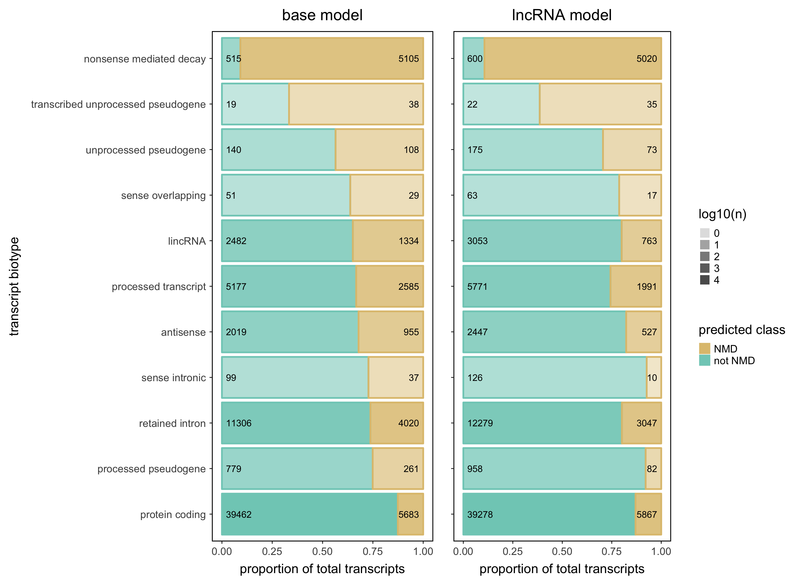

```{r setup, include=FALSE}
knitr::opts_chunk$set(echo = TRUE)
```

## Quick usage guide

```{r usenotNMD}
suppressWarnings({suppressMessages({
    library(GeneStructureTools)
    library(notNMD)
    library(GenomicRanges)
})})

# import gtf annotation
gtf <- rtracklayer::import("~/Downloads/gencode.v21.annotation.gtf.gz")
# load BSgenome annotation
g <- BSgenome.Hsapiens.UCSC.hg38::BSgenome.Hsapiens.UCSC.hg38

# test on a lincRNA and a protein coding gene
test_genes <- gtf[which(gtf$type=="exon"  & gtf$transcript_support_level < 3 
                        & gtf$gene_name %in% c("SMIM12", "HULC"))]

orf_details <- getOrfs(test_genes, 
                       BSgenome = g, # BSgenome object for nt sequences
                       returnLongestOnly = TRUE, # return all 3 frames
                       uORFs = TRUE)

# predict NMD potential
orf_details$nmd_prob <- predictNMD(orf_details, output="prob") # as probability value
orf_details$nmd_class <- predictNMD(orf_details, output="class") # as binary class

# summarise
orf_details$transcript_type <- gtf$transcript_type[match(orf_details$id, gtf$transcript_id)]
table(orf_details$nmd_class, orf_details$transcript_type)

```
```{r}
# predict NMD potential (with lncRNA model)
orf_details$nmd_prob.lnc <- predictNMD(orf_details, output="prob", model="lncRNA") # as probability value
orf_details$nmd_class.lnc <- predictNMD(orf_details, output="class", model="lncRNA") # as binary class

table(orf_details$nmd_class.lnc, orf_details$transcript_type)
```
 
## Performance

Performance from testing datasets

```{r}
library(caret)
base_performance <- read.csv("source_data/base_model_performance.csv")
base_performance$pred_class <- ifelse(base_performance$prob > 0.5, "nonsense_mediated_decay", "not_nmd")

confusionMatrix(base_performance$Class, base_performance$pred_class)


lnc_performance <- read.csv("source_data/lnc_model_performance.csv")
lnc_performance$pred_class <- ifelse(lnc_performance$prob > 0.5, "nonsense_mediated_decay", "not_nmd")

confusionMatrix(lnc_performance$Class, lnc_performance$pred_class)
``` 

proportion of different transcript biotypes classed as nmd or not_nmd by both models


